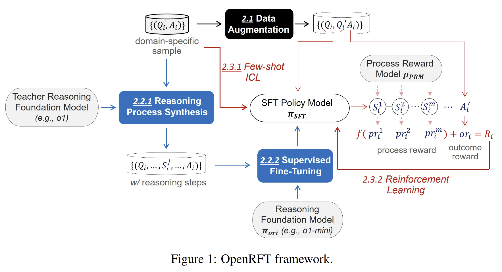

# OpenRFT: Adapting Reasoning Foundation Model for Domain-Specific Tasks with Reinforcement Fine-Tuning

[Technical report](report/OpenRFT.pdf)
[arxiv](https://arxiv.org/abs/2412.16849)

OpenRFT is an open-source project that aims to adapt generalist reasoning foundation models to domain-specific tasks through Reinforcement Fine-Tuning (RFT). By leveraging domain-specific samples, OpenRFT addresses challenges such as the lack of reasoning step data and the limited quantity of training samples, enabling efficient fine-tuning for domain-specific tasks.

<div align="center">
  
</div>

## News


### - 2024-12-22
- Updated the training and evaluation code for OpenRFT


### - 2024-12-21
- Updated the technical report for OpenRFT.


## Dependency

The training code for this project relies on [OpenRLHF](https://github.com/OpenRLHF/OpenRLHF) and [trl](https://github.com/huggingface/trl).

## Project Structure

The OpenRFT project is organized as follows:
```
OpenRFT/
├── assets/           
├── report/           
├── src/              # Main source code for the project.
│   ├── evaluate/     # Scripts and utilities for model evaluation. It can also be used to sample data.
│   ├── PPO/          # Implementation of PPO for reinforcement learning. The most important part is a remote reward service startup script.
│   └── SFT/          # Supervised Fine-Tuning (SFT) code for initial training using domain-specific samples.
├── LICENSE           # Licensing information for the project.
└── README.md         
```


## License

This work is released under the MIT License. See the [LICENSE](./LICENSE) file for more details. By using this code or associated materials, you agree to comply with the terms outlined in the license.


